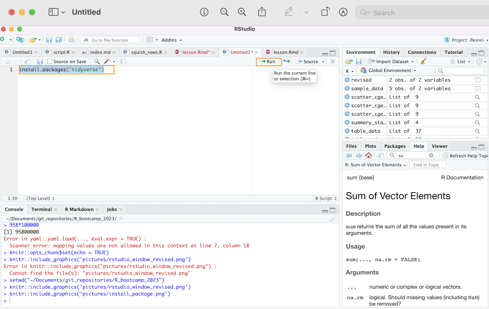

```{r setup, include=FALSE}
knitr::opts_chunk$set(echo = TRUE)
```

```{r, echo=F, warning=F, message=F}
library(tidyverse)
library(wosr)
library(DT) 
library(psych)
library(fastDummies)
library(janitor)
library(tidytext)
library(wordcloud2)
```

# Introduction

In this tutorial, we'll explore important principles and tools for working with data in R. Its goal is not to provide a comprehensive introduction to the R language, but to provide a practical and example-driven discussion that serves as a starting point for your own exploration. Topics covered include:

* R as a calculator
* Object/Variable assignment
* Data structures
* Writing basic custom functions
* Iteration using the *purrr* package
* Importing and exporting data from R
* Functions for wrangling, visualizing, and processsing numeric data
* Functions for working with and visualizing text data
* Automating basic data workflows using custom functions and iteration

At the start of the session, please [download the workshop data](https://www.dropbox.com/sh/wv6yqtw98umsrto/AACwnspy4wR2ER6jI90YB2dra?dl=0). 

# Preliminaries

In this preliminary section, we'll cover basic information that will help you to get started with RStudio.

## R and RStudio Installation

If you haven't already, please go ahead and install both the R and RStudio applications. R and RStudio must be installed separately; you should install R first, and then RStudio. The R application is a bare-bones computing environment that supports statistical computing using the R programming language; RStudio is a visually appealing, feature-rich, and user-friendly interface that allows users to interact with this environment in an intuitive way. Once you have both applications installed, you don't need to open up R and RStudio separately; you only need to open and interact with RStudio (which will run R in the background). 

The following subsections provide instructions on installing R and RStudio for the macOS and Windows operating systems. These instructions are taken from the "Setup" section of the Data Carpentry Course entitled [*R for Social Scientists*](https://datacarpentry.org/r-socialsci/setup.html). The Data Carpentry page also contains installation instructions for the Linux operating system; if you're a Linux user, please refer to that page for instructions. 

The Appendix to Garret Grolemund's book *Hands on Programming with R* also provides an [excellent overview of the R and RStudio installation process](https://rstudio-education.github.io/hopr/). 

### Windows Installation Instructions

+ Download R from the [CRAN website](https://cran.r-project.org/bin/windows/base/)
+ Run the ```.exe``` file that was just downloaded.
+ Go to the [RStudio download page](https://www.rstudio.com/products/rstudio/download/#download) and under *Installers* select the "Windows" option.
+ Double click the file to install RStudio
+ Open RStudio to make sure it works. 

### macOS Installation Instructions

+ Download R from the [CRAN website](https://cran.r-project.org/bin/macosx/)
+ Select the ```.pkg``` file for the latest R version.
+ Double click on the downloaded file to install R.
+ It is also a good idea to install [XQuartz](https://www.xquartz.org/), which some packages require.
+ Go to the [RStudio download page](https://www.rstudio.com/products/rstudio/download/#download), and under *Installers* select the "macOS" option.
+ Double click the file to install RStudio
+ Open RStudio to make sure it works. 

## The RStudio Interface 

Now that we've installed and opened up RStudio, let's familiarize ourselves with the RStudio interface. When we open up RStudio, we'll see a window that looks something like this:

```{r, echo=FALSE, results='asis', out.width='100%', fig.cap='The RStudio Interface', fig.alt='RStudio Interface Open on Desktop'}
knitr::include_graphics('pictures/rstudio_window_revised.png')
```

If your interface doesn't look exactly like this, it shouldn't be a problem; we would expect to see minor cosmetic differences in the appearance of the interface across operating systems and computers (based on how they're configured). However, you should see four distinct windows within the larger RStudio interface:

- The **top-left** window is known as the *Source* window. 
  - The *Source* window is where we can write our R scripts (including the code associated with this tutorial), and execute those scripts. We can also type in R code into the "Console" window (bottom-left window), but it is preferable to write our code in a script within the source window. That's because scripts can be saved (while code written into the console cannot); writing scripts therefore allows us to keep track of what we're doing, and facilitates the reproducibility of our work. Note that in some cases, we may not see a *Source* window when we first open RStudio. In that case, to start a new script, simply click the ```File``` button on the RStudio menu bar, scroll down to ```New File``` button, and then select ```R Script``` from the menu bar that opens up.
  - It's also worth noting that the outputs of certain functions will appear in the *Source* window. In the context of our tutorial, when we want to view our datasets, we will use the ```View()``` function, which will display the relevant data within a new tab in the *Source* window. 
- The **top-right** window is the *Environment/History* pane of the RStudio interface. 
  - The "Environment" tab of this window provides information on the datasets we've loaded into RStudio, as well as objects we have defined (we'll talk about objects more later in the tutorial). 
  -The "History" tab of the window provides a record of the R commands we've run in a given session. 
- The **bottom-right** window is the *Files/Plots/Packages/Help/Viewer* window. 
  - The "Files" tab displays our computer's directories and file structures and allows us to navigate through them without having to leave the R environment. 
  - The "Plots" tab is the tab where we can view any visualizations that we create. Within the "Plots" tab, make note of the "Zoom" button, which we can use to enlarge the display of our visualizations if they're too compressed in the "Plots" window. Also, note the "Export" button within the "Plots" tab (next to the "Zoom" button); we can use this button to export the displayed visualization to a .png or .jpeg file that can be used outside of RStudio. 
  - The "Packages" tab provides information on which packages have been installed, as well as which packages are currently loaded (more on packages in Sections 2.3 and 2.4 below)
  - The "Help" tab displays documentation for R packages and functions. If you want to know more about how a package or function work, we can simply type a "?" followed by the package or function's name (no space between the question mark and the name) and relevant information will be displayed within the "Help" tab. 
  - The "Viewer" tab displays HTML output. If we write code that generates an HTML file, we can view it within the "Viewer" tab.
- The **bottom-left** window is the *Console/Terminal/Jobs* window. 
  - The "Console" tab is where we can see our code execute when we run our scripts, as well as certain outputs produced by those scripts. In addition, if there are any error or warning messages, they will be printed to the "Console" tab. We can also type code directly into the console, but as we noted earlier, it is better practice to write our code in a script and then run it from there. 
  - The "Terminal", "Jobs" tabs  are not relevant for our workshop. We'll briefly provide an overview of "R Markdown" towards the end of the lesson. 
  
## Install Packages 

R is an open-source programming language for statistical computing that allows users to carry out a wide range of data analysis and visualization tasks (among other things). One of the big advantages of using R is that it has a very large user community among social scientists, statisticians, and digital humanists, who frequently publish R packages. One might think of packages as workbooks of sorts, which contain a well-integrated set of R functions, scripts, data, and documentation; these "workbooks" are designed to facilitate certain tasks or implement useful procedures. These packages are then shared with the broader R user community, and at this point, anyone who needs to accomplish the tasks to which the package addresses itself can use the package in the context of their own projects. The ability to use published packages considerably simplifies the work of applied data research using R; it means that we rarely have to write code entirely from scratch, and can build on the code that others have published in the form of packages. This allows applied researchers to focus on substantive problems, without having to get too bogged down in complicated programming tasks. 

In this workshop, we will use the following packages to carry out relevant data analysis and visualization tasks (please click the relevant link to learn more about a given package; note that the tidyverse is not a single package, but rather an entire suite of packages used for common data science and analysis tasks): 
+ [*tidyverse*](https://www.tidyverse.org): 
+ [*wosr*](https://cran.r-project.org/web/packages/wosr/wosr.pdf)

To install a package in R, we can use the ```install.packages()``` function. A function is essentially a programming construct that takes a specified input, runs this input (called an "argument") through a set of procedures, and returns an output. In the code block below, the name of the package we want to install (here, the *tidyverse* suite) is enclosed within quotation marks and placed within parentheses after printing ```install.packages``` Running the code below will effectively download the *tidyverse* suite of packages to our computer:

```{r, eval=FALSE}
# Installs "tm" package
install.packages("tidyverse")
```

To run this code in your own R session:

* First, copy the code from the codeblock above (you can copy the code to your clipboard by hovering over the top-right of the code-block and clicking the "copy" icon; you can also highlight the code and copy from the ```Edit``` menu of your browser). 
* Then, start a new R script within RStudio; if you want to keep a future record of your work, you may want to save this script to your computer (perhaps in the same folder to which you downloaded the tutorial data). We can save our scripts via the RStudio "File" menu.
* Paste the code into the script, highlight it, and click the "Run" button that is just above the *Source* window.
* Alternatively, instead of copying/pasting, you can manually type in the code from the codeblock into your script (manually typing in the code is slower, but often a better way to learn than copy/pasting). 
* After you've run the code, watch the code execute in the console, and look for a message confirming that the package has been successfully installed. 

Below, we can see how that line of code should look in your script, and how to run it:

```{r, echo=FALSE, results='asis', out.width='100%', fig.cap='Installing tidyverse in R Script'}

```

Please note that you can follow along with the tutorial on your own computers by transferring all of the subsequent codeblocks into your script in just this way. Run each codeblock in your RStudio environment as you go, and you should be able to replicate the entire tutorial on your computer. You can copy-paste the workshop code if you wish, but we recommend actually retyping the code into your script, since this will help you to more effectively familiarize yourself with the process of writing code in R.

Note that the codeblocks in the tutorial usually have a comment, prefaced by a hash ("#"). When writing code in R (or any other command-line interface) it is good practice to preface one's code with brief comments that describe what a block of code is doing. Writing these comments can allow someone else (or your future self) to read and quickly understand the code more easily than otherwise might be the case. The hash before the comment effectively tells R that the subsequent text is a comment, and should be ignored when running a script. If one does not preface the comment with a hash, R wouldn't know to ignore the comment, and would throw an error message.

Now, let's install the other packages we mentioned above, using the same ```install.packages()``` function: 

```{r, eval=F}
install.packages("wosr")
```

All of the packages we need are now installed!

## Load libraries

However, while our packages are installed, they are not yet ready to use. Before we can use our packages, we must load them into our environment. We can think of the process of loading installed packages into a current R environment as analogous to opening up an application on your phone or computer after it has been installed (even after an application has been installed, you can't use it until you open it!). To load (i.e. "open") an R package, we pass the name of the package we want to load as an argument to the ```library()``` function. For example, if we want to load our *tidyverse* packages into the current environment, we can type:


```{r, eval=F}
# Loads tidyverse packages into memory
library(tidyverse)
```

At this point, the full suite of the *tidyverse* suite's functionality is available for us to use. 

Now, let's go ahead and load the remainder of the packages that we'll need:

```{r, eval=F}
# loads remainder of required packages
library(wosr)
library(psych)
library(fastDummies)
library(janitor)
library(tidytext)
library(wordcloud2)
```

At this point, the packages are loaded and ready to go! One important thing to note regarding the installation and loading of packages is that we only have to install packages once; after a package is installed, there is no need to subsequently reinstall it. However, we must load the packages we need (using the ```library``` function) every time we open a new R session. In other words, if we were to close RStudio at this point and open it up later, we would **not** need to install these packages again, but **would** need to load the packages again.  

# Part 1: Foundations for Data Analysis in R

Before we can get a sense of how to work with data in R, it is important to familiarize ourselves with basic features of the R language's syntax, and the basic data structures that are used to store and process data. 

## R as a Calculator

At its most basic, R can be used as a calculator. For instance: 

```{r}
# calculates 2+2
2+2
```

```{r}
# calculates 65 to the power of 4
65^4
```

While this is a useful starting point, the possibility of assigning values to objects (or variables) considerably increases the scope of the operations we are able to carry out. We turn to object assignment in the next sub-section. 

## Object assignment and manipulation

The concept of object (or variable) assignment is a fundamental concept when working in a scripting environment; indeed, the ability to easily assign values to objects is what allows us to easily and intuitively manipulate and process our data in a programmatic setting. To better understand the mechanics of object assignment, consider the following:

```{r}
# assign value 5 to new object named x
x<-5
```

In the code above, we use R's assignment operator, ```<-```, to assign the value 5 to an object named ```x```. Now that an object named ```x``` has been created and assigned the value 5, printing ```x``` in our console (or printing ```x``` in our script and running it) will return the value that has been assigned to the ```x``` object, i.e. 5: 

```{r}
# prints value assigned to "x"
x
```

More generally, the process of assignment effectively equates the output created by the code on the right side of the assignment operator (```<-```) to an object with a name that is specified on the left side of the assignment operator. Whenever we want to look at the contents of an object (i.e. the output created by the code to the right side of the assignment operator), we simply print the name of the object in the R console (or print the name and run it within a script). 

Let's create another object, named ```y```, and assign it the value "12": 

```{r}
# assign value 12 to new object named y
y<-12
```

As we noted above, we can print the value that was assigned to ```y``` by printing its name:

```{r}
# prints value assigned to "y"
y
```

It's possible to use existing objects to assign values to new ones. For example, we can assign the sum of ```x``` and ```y``` to a new object that we'll name ```xy_sum```: 

```{r}
# creates a new object, named "xy_sum" whose value is the sum of "x" and "y"
xy_sum<-x+y
```

Now, let's print the contents of ```xy_sum```

```{r}
# prints contents of "xy_sum"
xy_sum
```

As expected, we see that the value assigned to ```xy_sum``` is "17" (i.e. the sum of the values assigned to ```x``` and ```y```). 

It is possible to change the value assigned to a given object. For example, let's say we want to change the value assigned to ```x``` from "5" to "8":

```{r}
# assign value of "8" to object named "x"
x<-8
```

We can now confirm that ```x``` is now associated with the value "8"

```{r}
# prints updated value of "x"
x
```

It's worth noting that updating the value assigned to ```x``` will not automatically update the value assigned to ```xy_sum``` (which, recall, is the sum of ```x``` and ```y```). If we print the value assigned to ```xy_sum```, note that it is still "17"): 

```{r}
xy_sum
```

In order for the value assigned to ```xy_sum``` to be updated with the new value of ```x```, we must run the assignment operation again:

```{r}
# assigns sum of "y" and newly updated value of "x" to "xy_sum" object
xy_sum<-x+y
```

Now, the value of ```xy_sum``` should reflect the updated value of ```x```, which we can confirm by printing the value of ```xy_sum```:

```{r}
# prints value of "xy_sum"
xy_sum
```

Note that the value assigned to ```xy_sum``` is now "20" (the sum of "8" and "12"), rather than "17" (the sum of "5" and "12").

While the examples above were very simple, we can assign virtually any R code, and by extension, the data structure(s) generated by that code (such as datasets, vectors, graphs/plots etc.) to an R object. When naming your objects, try to be descriptive, so that the name of the object signifies something about its corresponding value. 

Below, consider a simple example of an object, named ```our_location``` that has been assigned a non-numeric value. It's value is a string, or textual information:

```{r}
# assigns text string "Boulder, CO" to 
our_location<-"Boulder, CO"
```

We can print string that has been assigned to the ```location``` object by typing the name of the object in our console, or running it from our script:

```{r}
# prints value of "our_location" object
our_location
```

Note that generally speaking, you have a lot of flexibility in naming your R objects, but there are certain rules. For example, object names must start with a letter, and cannot contain any special symbols (they can only contain letters, numbers, underscores, and periods). Also, object names cannot contain multiple unconnected words; if you'd like to use multiple words or phrases, connect the discrete elements with an underscore (```_```), or use camel case (where different words are distinguished by beginning each discrete word begins with a capitalized letter). 

It is also worth emphasizing that object names are case sensitive; in order to print the value assigned to an object, that object's name must be printed *exactly* as it was created. For example, if we were to type ```our_Location```, we would get an error, since there is no ```our_Location``` object (only an ```our_location``` object):

```{r, error=TRUE}
our_Location
```

## Data structures

We now turn to a brief overview of some important data structures that help us to work with data in R. We will consider three data structures that are particularly useful: vectors, data frames, and lists. Note that this is not an exhaustive treatment of data structures in R; there are other structures, such as matrices and arrays, that are also important. However, we will limit our discussion to the data structures that are essential for getting started with data-based research in R. 

### Vectors

In R, a vector is a sequence of values. A vector is created using the ```c()``` function. For example, let's make a vector with some arbitrary numeric values:

```{r}
# makes vector with values 5,7,55,32
c(5, 7, 55, 32)
```

If we plan to work with this numeric vector again later in our workflow, it makes sense to assign it to an object, which we'll call ```arbitrary_values```:

```{r}
# assigns vector of arbitrary values to new object named "arbitrary_values"
arbitrary_values<-c(5,7,55.6,32.5)
```

Now, whenever we want to print the vector assigned to the ```arbitrary_values``` object, we can simply print the name of the object:

```{r}
# prints vector assigned to "arbitrary_values" object
arbitrary_values
```

It is possible to carry out mathematical operations with numeric vectors; for instance, let's say that we want to double the values in the ```arbitrary_values``` vector; to do so, we can simply multiply ```arbitrary_values``` by 2, which yields a new vector where each numeric element is twice the corresponding element in ```arbitrary_values```. Below, we'll create a new vector that doubles the values in ```arbitrary_values```, assign it to a new object named ```arbitrary_values_2x```, and print the contents of ```arbitrary_values_2x```:

```{r}
# creates a new vector that doubles the values in "arbitrary_values" and assigns it to a new object named
"arbitrary_values_2x"
arbitrary_values_2x<-arbitrary_values*2

# prints contents of "arbitrary_values_2x"
arbitrary_values_2x
```

Now, let's say we want to add different vectors together; the code below creates a new vector by adding together ```arbitrary_values``` and ```arbitrary_values_2x```:

```{r}
# adds "arbitrary_values" vector and "arbitrary_values_2x" vector
arbitrary_values + arbitrary_values_2x
```

Note that each element of the resulting vector printed above is the sum of the corresponding elements in ```arbitrary_values``` and ```arbitrary_values_2x```.

Other arithmetic operations on numeric vectors are also possible, and you may wish to explore these on your own as an exercise. 

In many cases, it is useful to extract a specific element from a vector. Each element in a given vector is assigned an index number, starting with 1; that is, the first element in a vector is assigned an index value of 1, the second element of a vector is assigned an index value of 2, and so on. We can use these index values to extract our desired vector elements. In particular, we can specify the desired index within square brackets after printing the name of the vector object of interest. For example, let's say we want to extract the 3rd element of the vector in ```arbitrary_values```. We can do so with the following:

```{r}
# extracts third element of "arbitrary_values_2x" vector
arbitrary_values[3]
```

It is also possible to extract a range of values from a vector using index values. For example, let's say we want to extract a new vector comprised of the second, third, and fourth numeric elements in ```arbitrary_values```; we can do so with the following:

```{r}
# extracts a new vector comprised of the 2nd, 3rd, and 4th elements of the existing "arbitrary_values" vector
arbitrary_values[2:4]
```

Thus far, we have been working with numeric vectors, where each of the vector's elements is a numeric value, but it is also possible to create vectors in which the elements are strings (i.e. text). Such vectors are know as character vectors. For example, the code below creates a character vector of the first four months of the year, and assigns it to a new object named ```months_four```:

```{r}
# creates character vector whose elements are the first four months of the year, and assigns the vector to a new object named "months_four"
months_four<-c("January", "February", "March", "April")
```

Let's now print the character vector assigned to ```months_four```: 

```{r}
# prints contents of "months_four"
months_four
```

We can extract elements from character vectors using index values in the same way we did so for elements in a numeric vector. For example:

```{r}
# extracts second element of "months_four" object (i.e. the "February" string)
months_four[2]
```

```{r}
# subsets the second and third elements of "months_four" object (i.e. the "February" and "March" strings, which are extracted as a new character vector)
months_four[2:3]
```

### Data frames

The data frame structure is the workhorse of data analysis in R. A data frame resembles a table, of the sort you might generate in a spreadsheet application. 

Often, the most important (and arduous) step in a data analysis workflow is to assemble disparate strands of data into a tractable data frame. What does it mean for a data frame to be "tractable"? One way to define this concept more precisely is to appeal to the concept of "tidy" data, which is [often referenced in the data science world](https://vita.had.co.nz/papers/tidy-data.pdf). Broadly speaking, a "tidy" data frame is a table in which:

1. Each variable has its own column
2. Each observation has its own row
3. Each value has its own cell

We will work extensively with data frames later in the workshop, but let's generate a simple data frame from scratch, and assign it to a new object. We will generate a data frame containing "dummy" country-level data on basic economic, geographic, and demographic variables, and assign it to a new object named ```country_df```. The data frame is created through the use of the ```data.frame()``` function, which has already been programmed into R. Column names and the corresponding column values are passed to the ```data.frame()``` function in the manner below, and the function effectively binds these different columns together into a table:

```{r}
# Creates a dummy country-level data frame 
country_df<-data.frame(Country=c("Country A", "Country B", "Country C"),
                       GDP=c(8000, 30000, 23500),
                       Population=c(2000, 5400, 10000),
                       Continent=c("South America", "Europe", "North America"))
```

To observe the structure of the table, we can print it to the R console by simply printing the name of the object to which it has been assigned:

```{r}
# prints "country_df" data frame to console
country_df
```

One nice feature of R Studio is that instead of simply printing our data frames into the console, we can view a nicely formatted version of our data frame by passing the name of the data frame object through the ```View()``` function. For example, the code below will bring up the ```country_df``` data frame as a new tab in R Studio:

```{r}
# pulls up "country_df" data frame in R Studio data viewer
View(country_df)
```

```{r, echo=F}
country_df %>% datatable(extensions=c("Scroller", "FixedColumns"), options = list(
  deferRender = TRUE,
  scrollY = 350,
  scrollX = 350,
  dom = "t",
  scroller = TRUE,
  fixedColumns = list(leftColumns = 3)
))
```

Note the "tidy" features of this simple data frame: 

1. Each of the variables (i.e. GDP, Population, Continent) has its own column
2. Each of the (country-level) observations has its own row
3. Each of the values (i.e. country-level information about a given variable) has its own distinct cell

We will explore data frames, and the process of extracting information from them, at greater length in subsequent sections. 

### Lists

In R, a list is a data structure that allows us to conveniently store a variety of different objects, of various types. For example, we can use a list to vectors, data frames, visualizations and graphs--basically any R object you can think of! It is also possible to store a list within a list. 

Lists allow us to keep track of the various objects we create, and are therefore a useful data management tool. In addition, lists are very helpful to use when we want to perform iterative operations across multiple objects. 

We can create lists in R using the ```list()``` function; the arguments to this function are the objects that we want to include in the list. In the code below, we'll create a list (assigned to an object named ```example_list```) that contains some of the objects we create earlier in the lesson: the ```arbitrary_values``` vector, the ```months_four``` vector, and the ```country_df``` data frame. 

```{r}
# creates list whose elements are the "arbitrary_values" numeric vector, the "months_four" character vector, and the "country_df" data frame, and assigns it to a new object named "example_list"
example_list<-list(arbitrary_values, months_four, country_df)
```

Now that we've created our list object, let's print out its contents:

```{r}
# prints contents of "example_list"
example_list
```

As you can see, our list contains each of the various specified objects within a single, unified structure. We can access specific elements within a list using the specific index number of the desired element, in much the same way we did for vectors. When extracting a single list element from a list, the convention is to enclose the index number of the desired list element in double square brackets. For example, if we want to extract the country-level data frame from ```example_list```, we can use the following:

```{r}
# extracts country-level data frame from "example_list"; the country-level data frame is the third element in "example_list"
example_list[[3]]
```

If we want to subset a list, and extract more than one list element as a separate list, we can do so by creating a vector of the index values of the desired elements, and enclosing it in single brackets after the name of the list object. For example, if we wanted to generate a new list that contained only the first and third elements of ```example_list``` (the numeric vector of arbitrary values and the data frame), we would use the following syntax:

```{r}
example_list[c(1,3)]
```

While list elements are not automatically named, we can name our list element using the ```names()``` function. The first step to define a character vector of desired names. We can specify any names we'd like but for the sake of illustration, let's say we want to name the first list element "element1", the second list element "element2", and the third list element "element3". Let's create a vector of our desired names, and assign it to an object named ```name_vector```:

```{r}
# creates a character vector of desired names for list elements, and assigns it to a new object named "name_vector"
name_vector<-c("element1", "element2", "element3")
```

Now, we'll assign these names in ```name_vector``` to the list elements in ```example_list``` with the following

```{r}
# assigns names from "name_vector" to list elements in "example_list"
names(example_list)<-name_vector
```

Let's now print the contents of ```example_list```:

```{r}
# prints contents of "example_list"
example_list
```

Note that the list elements now have names attached to them; the first character string in ```name_vector``` is assigned as the name of the first element in ```example_list```, the second character string in ```name_vector``` is assigned as the name of the second element in ```example_list```, and so on. 

Practically speaking, we can now extract list elements using the assigned names. For example, if we want to extract the data frame from ```example_list```, we could do so by its assigned name ("element3"), as follows:

```{r}
# Extracts the data frame from "example_list" by its assigned name
example_list[["element3"]]
```

Note that even after assigning names to list elements, you can still extract elements by their index value, if you would prefer to do so:

```{r}
# # Extracts the "element3" data frame from "example_list" by its index number
example_list[[3]]

```

### Identifying data structures

It is useful to be able to quickly identify the data structure of a given object. Indeed, one way that things can go wrong when processing or analyzing data in R is that a given function expects a certain type of data structure as an input, but encounters something else, which will cause the function to throw an error or perform unexpectedly. In such circumstances, it is especially useful to be able to quickly double-check the data structure of a given object. 

We can quickly ascertain this information by passing a given object as an argument to the ```class()``` function, which will provide information about the object's data structure.

For example, let's say we want to confirm that ```example_list``` is indeed a list:

```{r}
# print the data structure of the "example_list" object
class(example_list)
```

Let's take another example:

```{r}
# print the data structure of the "months_four" object
class(months_four)
```

Note that we can read "character", as "character vector". 

Similarly, we can read "numeric" as "numeric vector":

```{r}
# print the data structure of the "arbitrary_values" object
class(arbitrary_values)
```

## Functions

As we mentioned earlier, a function is  a programming construct that takes a set of inputs (also known as arguments), manipulates those inputs/arguments in a specific way (the body of the function), and returns an output that is the product of how those inputs are manipulated in the body of the function. It is much like a recipe, where the recipe's ingredients are analogous to a function's inputs, the instructions about how to combine and process those ingredients are analogous to the body of the function, and the end product of the recipe (for example, a cake) is analogous to the function's output. R packages are essentially pre-written collections of functions organized around a given theme, and for a large number of data processing and analysis tasks, one can rely on these pre-written functions. In some cases, however, you may want to write your own functions from scratch. 

Why might you want to write your own functions?

* Sometimes, there won't be a convenient pre-programmed function available to accomplish a given task, which will require you to write your own custom function. 
* Writing your own functions will allow you to automate your workflows
* Writing functions will allow you to write more concise and readable code.

Writing your own functions can be challenging, but this section will provide you with some basic intuition for how the process works. To develop this intuition, we'll use a very simple example. 

Let's say you have a large collection of temperature data, measured in Fahrenheit, and you want to convert these data to Celsius. Recall that the formula to convert from Fahrenheit to Celsius is the following, where "C" represents temperature in Celsius, and "F" represents temperature in Fahrenheit: 

```{r, eval=F}
# fahrenheit to Celsius formula, where "F" is fahrenheit input
C=(F-32)*(5/9)
```

Recall that at its most basic level, R is a calculator; if for example, we have a Fahrenheit measurement of 55 degrees, we can convert this to Celsius by plugging 55 into the conversion formula:

```{r}
# Converts 55 degrees fahrenheit to Celsius
(55-32)*(5/9)
```

This is easy enough, but if we have a large amount of temperature data that requires processing, we wouldn't want to carry out this calculation using arithmetic operators for each measurement in our data collection; that could quickly become unwieldy and tedious. Instead of repeatedly using arithmetic operators, we can wrap the Fahrenheit-to-Celsius conversion formula into a function:

```{r}
# Generates function that takes fahrenheit value ("fahrenheit_input") and returns a value in Celsius, and assigns the function to an object named "fahrenheit_to_celsius_converter"
fahrenheit_to_celsius_converter<-function(fahrenheit_input){
  celsius_output<-(fahrenheit_input-32)*(5/9)
  return(celsius_output)
}
```

Let's unpack the code above, which we used to create our function:

* We declare that we are creating a new function with the word ```function```; within the parenthesis after ```function```, we specify the function's argument(s). Here, the function's argument is an input named ```fahrenheit_input```. The name of the argument(s) is arbitrary, and can be anything you like; ideally, its name should be informed by relevant context. Here, the argument/input to the function is a temperature value expressed in degrees Fahrenheit, so the name "fahrenheit_input" describes the nature of this input. 
* After enclosing the function's arguments within parentheses, we print a right-facing curly brace ```{```, and then define the body of the function (i.e. the recipe), which specifies how we want to transform this input. In particular, we take ```fahrenheit_input```, subtract 32, and then multiply by 5/9, which transform the input to the celsius temperature scale. We'll tell R to assign this transformed value to a new object, named ```celsius_output```. 
* In the function's final line, ```return(celsius_output)```, we specify the value we want the function to return. Here, we are saying that we want the function to return the value that was assigned to ```celsius_output```. We then close the function by typing a left-facing curly brace below the return statement ```}```.
* Just as we can assign data or visualizations to objects that allow us to subsequently retrieve the outputs of our code, so too with functions. Here, we'll assign the function we have just return to an object named ```fahrenheit_to_celsius_converter```. 

After creating our function by running that code, we can use the newly created ```fahrenheit_to_celsius``` function to perform our Fahrenheit to Celsius transformations. Let's say we have a Fahrenheit value of 68, and want to transform it to Celsius. Instead of the following calculation:

```{r}
# Uses arithmetic operation to convert 68 degrees Fahrenheit to Celsius
(68-32)*(5/9)
```

We can use our function:

```{r}
# Uses "fahrenheit_to_celsius_converter" function to convert 68 degrees Fahrenheit to Celsius
fahrenheit_to_celsius_converter(fahrenheit_input=68)
```

Above, we passed the argument "fahrenheit_input=68" to the ```fahrenheit_to_celsius_converter``` function that we created; the function then took this value (68), plugged it into "fahrenheit_input" within the function and assigned the resulting value to "celsius_output"; it then returned the value of "celsius_output" (20) back to us. 

Let's try another one: 

```{r}
fahrenheit_to_celsius_converter(fahrenheit_input=22)
```

In short, we can specify any value for the "fahrenheit_input" argument; this value will be substituted for "fahrenheit_input" in the expression ```celsius_output<-(fahrenheit_input-32)*(5/9)```, after which the value of ```celsius_output``` will be returned to us. 

Even though the Fahrenheit to Celsius conversion formula is not particularly complex, it is clear that writing a function to perform this calculation is nonetheless more efficient than repeatedly performing the relevant arithmetic operation. As the operations you need to perform on your data become more complex, and the number of times you need to perform those operations increases, the benefits of wrapping those operations into a function become ever-more apparent. 

## Iteration

Once we have a function written down, it is straightforward to apply that function to multiple inputs in an iterative fashion. For example, let's say you have four different Fahrenheit temperature values that you would like to convert to celsius, using the ```fahrenheit_to_celsius_converter``` we developed above. One option would be to apply the ```fahrenheit_to_celsius_converter``` function to each of the Fahrenheit temperature inputs individually. For example, let's say our Fahrenheit values, which we'd like to convert to celsius, are the following: 45.6, 95.9, 67.8, 43. We could, of course, run these values through the function individually, as below:

```{r}
fahrenheit_to_celsius_converter(fahrenheit_input=45.6)

fahrenheit_to_celsius_converter(fahrenheit_input=95.9)

fahrenheit_to_celsius_converter(fahrenheit_input=67.8)

fahrenheit_to_celsius_converter(fahrenheit_input=43.)
```

This is manageable with a collection of only four Fahrenheit values, but would quickly become tedious if you had a substantially larger set of Fahrenheit temperature values that required conversion. Instead of  manually applying the function to each individual input value, we can instead put these values into a vector, and then iteratively apply the ```fahrenheit_to_celsius_converter``` function to each of these vector elements. 

Let's first assign our Fahrenheit temperature values to a numeric vector object named ```fahrenheit_input_vector```: 

```{r}
# makes a vector out of Fahrenheit values we want to convert, and assigns it to a new object named "fahrenheit_input_vector"
fahrenheit_input_vector<-c(45.6, 95.9, 67.8, 43)
```

Our goal is to also iteratively apply our function to all of these vector elements, and deposit the transformed results into a new vector.  In programming languages, functions are typically applied to to multiple inputs in an iterative fashion using a construct known as a for-loop, which some of you may already be familiar with. R users also frequently use specialized functions (instead of for-loops) to iterate over elements; this is often faster, or at the very least, makes R scripts more readable. One family of these iterative functions is the "Apply" family of functions. A more recent set of functions that facilitate iteration is part of the *tidyverse*, and is found within the [*purrr*](https://purrr.tidyverse.org/) package. These functions are known as ```map()``` functions, and we will use them here to iteratively apply our functions to multiple inputs. 

Let's see how we can use a ```map()``` function to sequentially apply the ```fahrenheit_to_celsius_converter()``` function we created to several different values for the "fahrenheit_input" argument, contained in ```fahrenheit_input_vector```. We'll pass ```fahrenheit_input_vector``` as the first argument to the  ```map_dbl()``` function, and ```fahrenheit_to_celsius_converter``` (i.e. the function we want to apply iteratively to the elements in `the```fahrenheit_input_vector``` ) as the second argument. The result of this operation will be a new "results vector", containing the transformed temperature values for each input in the original vector of Fahrenheit values (```fahrenheit_input_vector```). We'll assign this result/output vector to a new object named ```celsius_outputs_vector```: 

```{r}
# Iteratively applies the "fahrenheit_to_celsius_converter" to celsius input values in "fahrenheit_input_vector" and assigns the resulting vector of converted temperature values to "celsius_ouputs_vector"
celsius_outputs_vector<-map_dbl(fahrenheit_input_vector, fahrenheit_to_celsius_converter)
```

In short, the code above takes ``fahrenheit_input_vector``` (i.e. a vector with the numbers 45.6, 95.9, 67.8, 43), and runs each of these numbers through the ```fahrenheit_converter()``` function, and sequentially deposits the transformed result to the newly created ```celsius_outputs_vector()``` object, which contains the following elements:

```{r}
# prints contents of "celsius_outputs_vector"
celsius_outputs_vector
```

More explicitly, the code that reads ```celsius_outputs_vector<-map_dbl(fahrenheit_input_vector, fahrenheit_converter)``` did the following:

1. Pass 45.6 (the first element in the input vector, ```fahrenheit_input_vector```) to the ```fahrenheit_converter()``` function, and place the output (7.555556) as the first element in a new vector of transformed values, named ```celsius_outputs_vector```.
2. Pass 95.9 (the second element in the input vector, ```fahrenheit_input_vector```) to the ```fahrenheit_converter()``` function, and deposit the output (35.500000) as the second element in ```celsius_outputs_vector```. 
3. Pass 67.8 (the third element in the input vector,  ```fahrenheit_input_vector```) to the ```fahrenheit_converter()``` function, and deposit the output (19.888889) as the third element in ```celsius_outputs_vector```. 
4. Pass 43 (the fourth element in the input vector, ```fahrenheit_input_vector```) to the ```fahrenheit_converter()``` function, and deposit the output (6.111111) as the fourth element in ```celsius_outputs_vector```. 

There are a variety of ```map()``` functions from the *purrr* package, and the precise one you should use turns on the number of arguments used by the function (in this example, there is of course only one argument, i.e. "fahrenheit_input"), and the desired class of the output (i.e. numeric vector, character vector, data frame, list etc.). For example, let's say we want to apply the ```fahrenheit_to_celsius_converter``` function iteratively to the input values in ```fahrenheit_input_vector```, but that we want the output values to be stored as a list, rather than as a vector. Instead of using the ```map_dbl()``` function, we can use the ```map()``` function, which always returns outputs as a list. Below, we pass  our input vector (```fahrenheit_input_vector```),  and the function we want to iteratively apply to the elements of the input vector (```fahrenheit_converter```) to the ```map()``` function. We'll assign the output list to a new object named ```celsius_outputs_list```: 

```{r}
# iteratively applies the "fahrenheit_to_celsius_converter" function to the input values in "fahrenheit_input_vector", and assigns the list of celsius output values to a new object named "celsius_outputs_list"
celsius_outputs_list<-map(fahrenheit_input_vector, fahrenheit_to_celsius_converter)
```

Let's print out the list of output values:

```{r}
# prints contents of "celsius_outputs_list"
celsius_outputs_list
```

We can confirm that ```celsius_outputs_list``` is indeed a list using the ```class()``` function that we introduced earlier:

```{r}
# checks data structure of "celsius_outputs_list"
class(celsius_outputs_list)
```

Now, let's say we  we want to organize our information in a data frame, where one column represents our Fahrenheit input values, and the other column represents the corresponding Celsius output values. To do so, we'll first  slightly modify our function to return a data frame:

```{r}
# Creates function that takes an input value in degrees Fahrenheit (fahrenheit_input), converts this value to Celsius, and returns a data frame with the input Fahrenheit temperature value as one column, and the corresponding Celsius temperature value as another column; the function is assigned to a new object named "fahrenheit_to_celsius_converter_df" 
fahrenheit_to_celsius_converter_df<-function(fahrenheit_input){
  celsius_output<-(fahrenheit_input-32)*(5/9)
  celsius_output_df<-data.frame(fahrenheit_input, celsius_output)
  return(celsius_output_df)
}
```

Now, let's test out this new function for a single "fahrenheit_input" value, to make sure it works as expected; we'll test it out for a value of 63 degrees Fahrenheit:

```{r}
# applies "fahrenheit_to_celsius_converter_df" function to input value of 63 degrees Fahrenheit
fahrenheit_to_celsius_converter_df(fahrenheit_input=63)
```

Having confirmed that the function works as expected, let's now assemble a dataset using multiple Fahrenheit input values, where one column consists of these input values, and the second column consists of the corresponding Celsius outputs. We can do so using the ```map_dfr()``` function from the *purrr* package, which is a cousin of the ```map()``` and ```map_dbl()``` functions we explored above. While the ```map()``` function returns function outputs in a list, and the ```map_dbl()``` function returns function outputs in a numeric vector, the ```map_dfr()``` is used to bind together multiple function outputs rowwise into a data frame. To make this more concrete, let's consider the code below, which uses ```map_dfr()``` to iteratively apply the ```fahrenheit_to_celsius_converter_df``` function to the Fahrenheit values in ```fahrenheit_input_vector```, and assemble the resulting rows into a data frame that is assigned to a new object named ```celsius_outputs_df```:

```{r}
# Iteratively applies the "fahrenheit_to_celsius_converter_df" function to input values in "fahrenheit_input_vector" to generate a data frame with column of input Fahrenheit values, and column of corresponding output Celsius values; assigns this data frame to a new object named "celsius_outputs_df"
celsius_outputs_df<-map_dfr(fahrenheit_input_vector, fahrenheit_to_celsius_converter_df)
```

Let's now print the contents of ```celsius_outputs_df```:

```{r}
# prints contents of 
celsius_outputs_df
```

We now have a dataset with one column consisting of our Fahrenheit inputs (taken from ```fahrenheit_input_vector```), and a second column consisting of our Celsius outputs (derived by applying the ```fahrenheit_to_celsius_converter_df()``` function to our vector of input values, ````fahrenheit_input_vector```). 

We've just covered three different *purrr* functions: ```map()``` (which returns a list), ```map_dbl()``` (which returns a vector), and ```map_dfr()``` (which returns a dataframe). There are other map functions which return different types of objects; you can see a list of these other map functions by inspecting the documentation for the ```map()``` function:

```{r}
?map
```

The process of iteratively applying a function with more than one argument is beyond the scope of the workshop, but the same general principles are at work in those cases. If you'd like to explore the process of iteratively applying a function with two arguments, or more than two arguments, check out the documentation for the ```map2()``` and ```pmap()``` functions, respectively.

Before we move into the next section, let's consider one more example of how you can use your own custom-written functions in conjunction with the iteration functions in the *purrr* package to write scripts that can help you to automate tedious tasks. In particular, we'll demonstrate the utility of the list data structure in helping you to carry out such automation tasks. 

Let's say, for example, that you have temperature values stored in Fahrenheit, for multiple countries, and want to quickly convert those country-level values to degrees Celsius. Suppose that these Fahrenheit values are stored in a series of vectors:

```{r}
# creates sample country-level Fahrenheit data for Country A
countryA_fahrenheit<-c(55,67,91,23, 77, 98, 27)

# creates sample country-level Fahrenheit data for Country B
countryB_fahrenheit<-c(33,45,11,66, 44)

# creates sample country-level Fahrenheit data for Country C
countryC_fahrenheit<-c(60,55,12,109)

# creates sample country-level Fahrenheit data for Country D
countryD_fahrenheit<-c(76, 24, 77, 78)
```

Let's say that we want to take all of these vectors, and iteratively pass them as arguments to the ```fahrenheit_to_celsius_converter_df```  function, thereby creating four country-specific data frames that have the original Fahrenheit values in one column and the transformed Celsius values in the other column. The easiest way to do this is to first put our input vectors into a list, which we'll assign to a new object named ```temperature_input_list```: 

```{r}
# Creates list of input vectors and assigns this list to new object named "input_list"
temperature_input_list<-list(countryA_fahrenheit, countryB_fahrenheit, countryC_fahrenheit, countryD_fahrenheit) 
```

Now, we'll use the ```map()``` function to iteratively pass the vectors in ```temperature_input_list``` as arguments to the ```fahrenheit_to_celsius_converter_df``` function, and deposits the resulting data frames into a list; we'll assign this list that contains the output data frames to a new list object, named ```processed_temperature_data_list```:

```{r}
# Iteratively passes vectors in "temperature_input_list" as arguments to "fahrenheit_to_celsius_converter_df" and deposits the resulting data frames to a list, which is assigned to a new object named "processed_temperature_data_list"
processed_temperature_data_list<-map(temperature_input_list, fahrenheit_to_celsius_converter_df)
```

In effect, the code above takes the ```countryA_fahrenheit``` vector, uses it as the argument to the ```fahrenheit_to_celsius_converter_df``` function, and deposits the resulting data frame as the first element in the ```processed_temperature_data_list``` list; it then takes the ```countryB_fahrenheit``` vector, uses it as the argument to the ```fahrenheit_to_celsius_converter_df``` function, and deposits the resulting data frame as the second element in the ```processed_temperature_data_list``` list; and so on.

Let's print the contents of ```processed_temperature_data_list``` and confirm that our data frames have been created as expected:

```{r}
# prints contents of "processed_temperature_data_list"
processed_temperature_data_list
```

As an exercise, try and extract a given dataset from ```processed_temperature_data_list``` using the indexing method we discussed above. Additionally, see if you can assign names to the list elements in ```processed_temperature_data_list```. 

# Part 2: Applied Data Work in R

The material in Part 1 was not intended as a comprehensive introduction to the R programming language. Its goal, rather, was to present some ideas, concepts, and tools that can serve as a general foundation for working with data in R. Now that we have this basic foundation, we'll turn in this section to a more applied exploration of some actual datasets. Our goal here is to introduce you to some useful functions that will allow you to explore and begin making sense of actual datasets in R. 

## Data Transfer Part 1: Reading in Data

Typically, the first step when working with research data in R Studio is to load your relevant data into memory. There are many ways to do this, and the precise way in which you will do so will depend on where your data is stored, and how it is structured. Below, we'll cover the process of reading your data into R Studio under a couple of different scenarios. 

### Reading in a dataset from a directory on your computer

Often (especially when a dataset is of tractable size), you will have the dataset you would like to analyze stored on a directory on your computer. In order to read in a dataset from a computer directory, you can use the ```read_csv()``` function (provided it is stored as a CSV; if the file type is different, than the import function would be different as well), and the pass dataset's file path as an argument to the function. Typically, you will want to assign the dataset you read in to a new R object:

```{r}
# Reads in Persson/Tabellini Data from local directory, and assigns it to new object named "pt"
pt<-read_csv("data/pt/persson_tabellini_workshop.csv")
```

If you'd like to view the contents of the dataset, pass it to the R Studio data viewer:

```{r}
# views "pt" data frame in R Studio data viewer
View(pt)
```

```{r}
pt %>% datatable(extensions=c("Scroller", "FixedColumns"), options = list(
  deferRender = TRUE,
  scrollY = 350,
  scrollX = 350,
  dom = "t",
  scroller = TRUE,
  fixedColumns = list(leftColumns = 3)
))
```

We'll be working more with this dataset below; if you'd like to learn more about the dataset's various variables, see the [codebook](https://www.dropbox.com/s/gn4d9mnqp8pds68/persson_tabellini_codebook.pdf?dl=0). The data was originally collected by the political economists Torsten Persson and Guido Tabellini for their book on *The Econmic Effects of Constitutions.*

### Reading in multiple datasets from your disk

Sometimes, your data is spread out over multiple files. For example, you may have multiple CSV files with data stored on disk, which you want to read into R at one-go, instead of loading in multiple files individually. 

To do so, we can use the list data structure to hold all of the desired files, and use the ```map()``` function we learned about above to iteratively read these files into our R environment. 

The first step is to use the ```list.files()``` function to create a character vector of the file names we want to read in; if all of the files you want to read in are already in your working directory, you don't need to supply any arguments to the ```list.files()``` function. If the files are stored in another location, you can specify the relevant file path as an argument to ```list.files()```. In the case below, the individual files we want to read in are thirteen Web of Science datasets (which were generated using the "climate" + "art" search parameters); these files are in the "wos" directory within the "data" subdirectory of the working directory:

```{r}
# print relevant file names, which are stored in the data/wos subdirectory
wos_files<-list.files("data/wos")
```

Let's now print the contents of "wos_files" and observe the file names":

```{r}
# prints contents of "wos_files"
wos_files
```

Now that we have our file names, we can iteratively pass them through the ```read_csv()``` function, and deposit the files as data frames in a list: 

```{r}
# Iteratively reads in all individual WOS files from the "data/wos" directory and assigns it to an object named "wos_file_list"
setwd("data/wos")
wos_file_list<-map(wos_files, read_csv)
```

The code above takes the first file name in ```wos_files()``` and then passes it to the ```read_csv()``` function and deposits the file as the first data frame in a new list; it then takes the second file name in ```wos_files()``` and then passes it to the ```read_csv()``` function and deposits that file as the second data frame in the list; and so on. The list containing all of the files is assigned to a new object named ```wos_file_list```; we'll print the contents below:

```{r}
# prints contents of "wos_file_list"
wos_file_list
```

We will work with the separate data frames in ```wos_file_list``` later in the tutorial. 

In some cases, however, if the different data frames read into a list all have the same structure (i.e. same variable names and number of variables), it is also sometimes useful to append the different data frames in a list together into one data frame. It is easy to carry out this operation using the ```bind_rows()``` function, which takes as its argument the name of the list containing the data frames whose rows we want to append together. Below, we'll assign the consolidated data frame created through this appending operation to a new object named ```ws_df_appended```:

```{r}
# appends data frames in "wos_file_list" into one data frame and assigns it to a new object named "ws_df_appended"
ws_df_appended<-bind_rows(wos_file_list)
```

You can now view the appended data frame in the R Studio data viewer by passing ```ws_df_appended``` to the ```View()``` function. In addition to working with the files separately, we will also use the consolidated ```ws_df_appended``` data frame to introduce some basic text analysis functions in R. 

### Reading in a dataset from cloud storage

At this point, we have all of the data we need for subsequent sections loaded in our R environment. However, before proceeding, it's worth noting some additional methods of reading in data into R.

If you store your data on the Cloud using a standard storage service such as Dropbox, you can simply extract the URL to the data from your service provider, and pass it as an argument to a data transfer function in R such as ```read_csv()```: 

```{r}
# Reads in PT dataset from Dropbox and assigns it to a new object named "pt_cloud"
pt_cloud<-read_csv("https://www.dropbox.com/s/iczslf52s8bzku2/persson_tabellini_workshop.csv?dl=1")
```

The code above reads in the Persson-Tabellini dataset that is stored on a Dropbox account straight into R using its URL as an argument, and assigns it to a new object named ```pt_cloud```. If you view ```pt_cloud``` in the data viewer, you'll notice that the dataset is exactly the same as the one assigned to the ```pt``` object. 

### Reading in data from an R package

Many R packages allow you to import data directly into your R environment via an Application Programming Interface (API), which is essentially a device that organizations use to provide access to their data. The R package *wosr*, for example, allows users to leverage the Web of Science API to directly import data from the Web of Science. Even after importing the Web of Science data into R via *wosr*, it takes a bit of effort to get the data into usable shape, so we won't make use of data imported from *wosr* later in the tutorial. Nevertheless, it can be instructive to see how this process works. For more details on *wosr* functions used below, inspect the relevant documentation by typing a "? before the function name in your console (or from a script). 

The first step is to set your authorization credentials; because CU has a Web of Science subscription (which you can automatically access from campus or through a campus VPN), we can simply set the user name and password to NULL in the session identifier, which is assigned to a new object named ```sid```:

```{r}
# creates WOS session identifier and assigns to object named "sid"
sid<-auth(username=NULL, password=NULL)
```

Now, we'll create a string that represents our Web of Science query; this text string is assigned to a new object name ```wos_query```:

```{r}
# Creates string for WOS query
wos_query<-'TS = ("climate" & "art") AND PY = (2015-2016)'
```

Now, we'll pass ```wos_query``` and ```sid``` as arguments to the ```pull_wos()``` function, which is the *wosr* function that allows for query-based data extraction from the Web of Science API. We'll assign the data to a new object named ```wos_api_climate_art```:

```{r}
# Pulls data from WOS API based on wos_query and assigns to object named "wos_api_climate_art"
wos_api_climate_art<-pull_wos(wos_query, sid=sid)
```

Now that the data has been downloaded, we'll check the class of ```wos_api_climate_art```:

```{r}
# checks class of "wos_api_climate_art"
class(wos_api_climate_art)
```

Note that the data is stored as a list, and we can print its contents below: 

```{r}
# prints contents of "wos_api_climate_art"
wos_api_climate_art
```

### Reading data from websites

If a dataset of interest is hosted on the web, it is usually straighforward to use the relevant URL to load the data directly into your R environment. For instance, consider this [dataset from CU Scholar](https://scholar.colorado.edu/concern/datasets/k643b228n). If we want to load the dataset into R directly, we can identify the relevant [download link](https://scholar.colorado.edu/concern/parent/k643b228n/file_sets/76537257b) by hovering over the blue "Download the file" button", and pass it as an argument to the ```read_csv()``` function (with ".csv" appended ): 

```{r}
# Reads in published dataset from CU Scholar and assigns it to a new object named "green_space_CUScholar"
green_space_CUScholar<-read_csv("https://scholar.colorado.edu/downloads/76537257b.csv")
```

Above, we assigned the data from that CU Scholar landing page to a new object named ```green_space_CUScholar```, which you can now view in the R Studio data viewer with ```View(green_space_CUScholar)```. 

## Numeric Data Processing, Wrangling, and Visualization

In this section, we will survey some useful functions (primarily from the *dplyr* package) for wrangling and processing numeric data. We will also introduce *ggplot2*, which is the most popular visualization package in R. We will demonstrate these functions using the Persson-Tabellini dataset on political-economic data (```pt```). 

### Make a copy of the dataset

We'll start by making a copy of the ```pt``` object, by assigning it to a new object named ```pt_copy```. We'll use ```pt_copy``` when exploring the dataset, which ensures that we do not make inadvertent changes to our original ```pt``` data frame, and can always refer back to it when needed. Keeping a "clean" version of the data, and carrying out analysis tasks on a copy of this dataset, is good data management practice. 

```{r}
# Make a copy of the dataset so we don't alter the original dataset; then, view
# the copied dataset 
pt_copy<-pt
```

We can go ahead and print the contents of ```pt_copy```, which, at this point, is identical to ```pt```:

```{r}
# Print contents of "pt_copy"
pt_copy
```

We can also view it in the data viewer:

```{r}
# Views "pt_copy" in data frame
View(pt_copy)
```

```{r, echo=F}
pt_copy %>% datatable(extensions=c("Scroller", "FixedColumns"), options = list(
  deferRender = TRUE,
  scrollY = 350,
  scrollX = 350,
  dom = "t",
  scroller = TRUE,
  fixedColumns = list(leftColumns = 3)
))
```

### Summary Statistics

Once you have a dataset loaded into R, one of the first things you'll want to do is likely to generate a table of summary statistics. A quick way to do that is to use the ```describe()``` function from the *psych* package. Below, we'll generate summary statistics for the ```pt_copy``` dataset by passing it to the ```describe()``` function, and assign the table of summary statistics to a new object named ```pt_copy_summarystats1```. We'll then view it in the data viewer:

```{r}
# Generate summary statistics for "pt_copy" and assign to new object named "pt_copy_summarystats1"
pt_copy_summarystats1<-describe(pt_copy)
```

```{r}
# View contents of "pt_copy_summarystats1" in data viewer
View(pt_copy_summarystats1)
```

```{r, echo=F}
pt_copy_summarystats1 %>% datatable(extensions=c("Scroller", "FixedColumns"), options = list(
  deferRender = TRUE,
  scrollY = 350,
  scrollX = 350,
  dom = "t",
  scroller = TRUE,
  fixedColumns = list(leftColumns = 3)
))
```

While having a simple table of summary statistics is often a useful starting point, it is often useful to generate group-level summary statistics, where summary statistics are presented for different subgroups in the dataset. One way to generate group summary statistics is to use the ```describeBy()``` function (also from the *psych* package), where the first argument is the data frame you would like to generate group-level summary statistics for, and the second argument is the column that contains the relevant groups. Below, we generate summary statistics for ```pt_copy``` parsed out by the different continents in the "continent" column. The expression ```pt_copy$continent``` indicates that the groups with respect to which we want to calcualte the summary statistics is in the "continent" column of the ```pt_copy``` data frame. More generally, we can explicitly refer to columns in an R data frame using this dollar-sign notation, where the expression before the dollar sign refers to the data frame object, and the expression after refers to the name of the column. 

The ```describeBy()``` function will produce a list that contains summary statistics for different groups as list elements. Below, we'll assign the list of group summary statistics to a new object named ```summary_stats_by_continent```:

```{r}
# Creates summary statistics for each continent grouping, and puts results in list named "summary_stats_by_continent"
summary_stats_by_continent<-describeBy(pt_copy, pt_copy$continent)
```

Now, let's say we want to extract the summary statistics for Africa, one of the continent categories in the "continent" column. We can do so using the double-bracket notation we discussed above:

```{r}
# Accessing continent-level summary statistics for africa from the "summary_stats_by_continent" list
summary_stats_by_continent[["africa"]]
```

Recall that we can assign list elements that we extract from a list to their own object, which allows us to conveniently retrieve it whenever it is needed. Below, we'll assign the summary statistics for Africa to a new object named ```africa_summary```:

```{r}
# Group-level summary statistics can be assigned to their own object for easy retrieval
africa_summary<-summary_stats_by_continent[["africa"]]
```

Another convenient way to retrieve group-level summary statistics is through the ```group_by()``` function in the *dplyr* package. First, we'll run the code below, and assign it to a new object named ```trade_age_by_continent```:

```{r}
# Generate a table that displays summary statistics for trade at the continent level and assign to object named "trade_age_by_continent"
trade_age_by_continent<-pt_copy %>% 
                          group_by(continent) %>% 
                            summarise(meanTrade=mean(trade),sdTrade=sd(trade),
                                      meanAge=mean(age), sdAge=sd(age),
                                      n=n())
```

Now, let's print the contents of ```trade_age_by_continent```:

```{r}
# prints contents of "trade_age_by_continent"
trade_age_by_continent
```

Let's now unpack the code that created this table. We started with the ```pt_copy``` data frame, and then used ```group_by(continent)``` to declare that subsequent calculations should be performed at the continent-level; then, within the ```summarise()``` function, we defined the column names we wanted to use in the group-level summary table, and how those variables are to be calculated. For example, ```meanTrade=mean(trade)``` indicates that we want the first column to be named "meanTrade", which is to be calculated by taking the mean of the "trade" variable for each continent grouping. After that, ```sdTrade=sd(trade)``` indicates that we want the second column to be named "sdTrade", which is to be calculated by taking the standard deviation of the "trade" variable for each continent grouping. And so on. Note that ```n=n()``` indicates that we want the final column, named "n", to provide information about the number of observations in each continent-level grouping. 

You might have noticed a mysterious symbol in the above code that comes immediately after ```pt_copy```, and immediately after ```group_by(continent)```. This symbol is known as a “pipe” (```%>%```). The pipe operator effectively takes the contents to its left, and then uses these contents as an input to the code on its right. Above, the pipe takes the contents of ```pt_copy``` on its left, and then feeds this data into the ```group_by()``` function on the right; then, after grouping the data by continent, it feeds this grouped data on its left into the ```summarise()``` function on its right.  We will use the pipe operator throughout the lesson to chain together functions in this manner. 

Finally, in addition to calculating summary statistics and group-level summary statistics, another useful way to explore your data is to generate simple crosstabs that show the breakdown of one variable with respect to the other. The code below uses the ```tabyl()``` function from the *janitor* package to compute a crosstab between the "federal" variable (i.e. this variable takes on the value of 1 if a country has a federal structure of government, and 0 if it's a unitary government) and the "continent" variable; it assigns the crosstab to a new object named ```crosstab_federal_continent```:

```{r}
# Creates cross-tab showing the breakdown of federal/non federal across continents
crosstab_federal_continent<-pt_copy %>% tabyl(federal, continent)
```

Let's print the contents of ```crosstab_federal_continent```:

```{r}
# prints contents of "crosstab_federal_continent"
crosstab_federal_continent
```

This tells us, for instance, that among Latin American countries, 19 had a unitary government, and 4 had federal structure of government. 

### Basic Data Cleaning and Preparation Tasks

After getting a sense of your data by computing some summary statistics and running some crosstabs, you'll often have a sense of how you would like to clean or transform your data for analysis. This section briefly describes some functions that are useful for these basic data-preparation tasks. 

**Rearranging Columns**

We can manipulate the order of the columns in a dataset using the ```relocate``` function. For example, the code below uses the ```relocate()``` function to shift the "country" column to the front of the dataset, and then assigns this change back to ```pt_copy``` to update the object:

```{r}
# bring the "country" column to the front of the dataset
pt_copy<-pt_copy %>% relocate(country)
```

You can confirm that the change has been implemented by viewing ```pt_copy``` in the data viewer:

```{r}
# Views "pt_copy" in data viewer
View(pt_copy)
```

```{r, echo=F}
pt_copy %>% datatable(extensions=c("Scroller", "FixedColumns"), options = list(
  deferRender = TRUE,
  scrollY = 350,
  scrollX = 350,
  dom = "t",
  scroller = TRUE,
  fixedColumns = list(leftColumns = 3)
))
```

You can specify more than one argument to the ```relocate``` function. For example, in the code below, passing the "country", "list", "trade", and "oecd" variables/columns to the ```relocate()``` function will make "country" the first column, "list" the second column, "trade" the third column, and so on. 

```{r}
# bring the "country", "list", "trade", "oecd" columns to the front of the dataset
pt_copy<-pt_copy %>% relocate(country, list, trade, oecd)
```

```{r}
# Views updated "pt_copy" data frame in data viewer
View(pt_copy)
```

```{r, echo=F}
pt_copy %>% datatable(extensions=c("Scroller", "FixedColumns"), options = list(
  deferRender = TRUE,
  scrollY = 350,
  scrollX = 350,
  dom = "t",
  scroller = TRUE,
  fixedColumns = list(leftColumns = 3)
))
```

**Renaming variables**

In order to rename variables, we can use the ```rename()``` function, as below. The code below renames the existing "list" variable to "party_list", which is more descriptive, and assigns the change back to the ```pt_copy``` object. 

```{r}
## Renaming a variable (renames "list" to "party_list")
pt_copy<-pt_copy %>% rename(party_list=list)
```

Check the ```pt_copy``` data frame in the viewer to ensure that the change has been made. 

**Sorting a dataset in ascending or descending order with respect to a variable**

It is often useful to sort a data frame in ascending or descending order with respect to a given variable. The code below sorts the ```pt_copy``` data frame in ascending order with respect to the "trade" variable using the ```arrange()``` function:

```{r}
# sorting in ascending (low to high) order with respect to the "trade" variable
pt_copy<-pt_copy %>% arrange(trade)
```

If, instead, you want to sort the dataset in descending order with respect to the "trade" variable, pass the name of the variable to the ```desc()``` function within the ```arrange()``` function, as below:

```{r}
# sorting in descending (high to low) order with respect to the "trade" variable
pt_copy<-pt_copy %>% arrange(desc(trade))
```

**Creating new variables based on existing variables**

Depending on your research question and empirical strategy, it is often useful or necessary to create new variables in your dataset, based on existing variables. To do so, we can use *dplyr's* ```mutate()``` function. The code below, for example, uses the ```mutate()``` function to create a new variable, named "non_catholic_80", that is computed by subtracting the existing "catho80" variable from 100; for convenience, the "country", "catho80", and newly created "non_catholic_80" variables are all moved to the front of the dataset using the ```relocate()``` function:

```{r}
# Create new variable named "non_catholic_80" that is calculated by substracting the Catholic share of the population in 1980 ("catho80") from 100  and relocates "country", "catho80", and the newly created "non_catholic_80" to the front of the dataset
pt_copy<-pt_copy %>% mutate(non_catholic_80=100-catho80) %>% 
                     relocate(country, catho80, non_catholic_80)
```

You can view the updated ```pt_copy``` data frame to confirm that the new variable has been created:

```{r}
# views updated "pt_copy" data frame in R Studio data viewer
View(pt_copy)
```

```{r, echo=F}
# prints updated contents of "pt_copy"
pt_copy %>% datatable(extensions=c("Scroller", "FixedColumns"), options = list(
  deferRender = TRUE,
  scrollY = 350,
  scrollX = 350,
  dom = "t",
  scroller = TRUE,
  fixedColumns = list(leftColumns = 3)
))
```

**Selecting or Deleting Variables**

Sometimes, you will have a dataset with many variables, and to make things more tractable, you'll want to select only the variables that are relevant to your analysis. You can explicitly select desired variables using the ```select()``` function from *dplyr*. The code below selects the "country", "cgexp", "cgrev", "trade", and "federal" columns from ```pt_copy```, and then assigns this selection to a new object named ```pt_copy_selection```:

```{r}
# Selects "country", "cgexp", "cgrev", and "trade" variables from the "pt_copy" dataset and assigns the selection to a new object named "pt_copy_selection"
pt_copy_selection<-pt_copy %>% 
                    select(country, cgexp, cgrev, trade, federal)
```

When you view the ```pt_copy_selection``` object in the data viewer, you'll see that we now have a new data frame that consists only of these variables:

```{r}
# views "pt_copy_selection" in data viewer
View(pt_copy_selection)
```

```{r, echo=F}
# prints updated contents of "pt_copy"
pt_copy_selection %>% datatable(extensions=c("Scroller", "FixedColumns"), options = list(
  deferRender = TRUE,
  scrollY = 350,
  scrollX = 350,
  dom = "t",
  scroller = TRUE,
  fixedColumns = list(leftColumns = 3)
))
```

Instead of selecting columns to keep, it may sometimes by easier to directly delete columns. For example, the code below deletes the "federal" variable from ```pt_copy_selection``` by passing it to the ```select()``` column with a "-" in front of it. 

```{r}
# deletes "federal" variable from "pt_copy_selection"
pt_copy_selection %>% select(-federal)
```

If you want to delete multiple columns, simply specify the columns in a vector, preceded by a minus sign, that is passed to the ```select()``` function. The code below, for instance, takes the existing ```pt_copy_selection``` data frame, deletes the "federal" and "trade" columns, and assigns the result to a new object named ```pt_copy_selection_modified```:

```{r}
# deletes "federal" and "trade" from "pt_copy_selection" and assigns it to new object named "pt_copy_selection_modified"
pt_copy_selection_modified<-pt_copy_selection %>% select(-c(federal, trade))
```

Check the ```pt_copy_selection_modified``` data frame in the data viewer to confirm these changes:

```{r}
# views "pt_copy_selection_modified" in data viewer
pt_copy_selection_modified
```

```{r, echo=F}
# prints updated contents of "pt_copy"
pt_copy_selection_modified %>% datatable(extensions=c("Scroller", "FixedColumns"), options = list(
  deferRender = TRUE,
  scrollY = 350,
  scrollX = 350,
  dom = "t",
  scroller = TRUE,
  fixedColumns = list(leftColumns = 3)
))
```

**Recoding Variables**

"Recoding" a variable refers to the process of taking an existing variable, and generating new variable(s) that represent the information from that original variable in a new way. Below, we'll consider some common recoding operations. 

*Creating Dummy Variables from Continuous Numeric Variables*

You may sometimes have a continuous numeric variable, but want to create a new dummy variable (a variable that takes on the value of 1 if a given condition is met, and 0 otherwise) based on that numeric variable. For example, let's say we want to create a new variable, named "trade_open" that takes on the value of 1 if the trade variable is greater than or equal to 77, and 0 otherwise. We can generate this new dummy variable using the ```mutate()``` function; within the ```mutate()``` function below, we specify that we want to create a new variable named "trade_open"; the ```ifelse()``` function specifies the desired condition (trade>=77), followed by the value the new "trade_open" variable is to take if the condition is met (1), and the value the new "trade_open" variable is to take if the condition is not met (0). In other words, we can translate ```ifelse(trade>=77, 1, 0)``` to "if trade>=77, set the 'trade_open' variable to 1, otherwise set it to 0." We'll assign the data frame with the new "trade_open" variable back to "pt_copy":

```{r}
# Creates a new dummy variable based on the existing "trade" variable named "trade_open" (which takes on a value of "1" if "trade" is greater than or equal to 77, and 0 otherwise) and then moves the newly created variable to the front of the dataset along with "country" and "trade"; all changes are assigned to "pt_copy", thereby overwriting the existing version of "pt_copy"

pt_copy<-pt_copy %>% mutate(trade_open=ifelse(trade>=77, 1, 0)) %>% 
                     relocate(country, trade_open, trade)
```

View the data frame to ensure that the new variable "trade_open", recoded based on "trade", has been created:

```{r, echo=F}
pt_copy %>% datatable(extensions=c("Scroller", "FixedColumns"), options = list(
  deferRender = TRUE,
  scrollY = 350,
  scrollX = 350,
  dom = "t",
  scroller = TRUE,
  fixedColumns = list(leftColumns = 3)
))
```

*Creating categorical variables from continuous numeric variables*

Sometimes, you will want to create a variable that contains categories or classifications that derive from numeric thresholds of an existing variable. For instance, let's say we want to take the existing "trade" variable, and define a new variable named "trade_level", which is set to "Low Trade" when the "trade" variable is greater than 15 and less than 50; "Intermediate_Trade" when the "trade" variable is greater than or equal to 50 and less than 100; and "High_Trade" when the "trade" variable is greater than or equal to 100. The code below creates this new "trade_level" variable using the ```mutate()``` function, and the ```case_when()``` function that maps the conditions onto the desired variable values for "trade_level" using the following syntax:

```{r}
# Creates a new variable in the "pt_copy" dataset named "trade_level" (that is coded as "Low Trade" when the "trade" variable is greater than 15 and less than 50, coded as "Intermediate Trade" when "trade" is greater than or equal to 50 and less than 100, and coded as "High TradE" when "trade" is greater than or equal to 100), and then reorders the dataset such that "country", "trade_level", and "trade" are the first three variables in the dataset
pt_copy<-pt_copy %>% mutate(trade_level=case_when(trade>15 & trade<50~"Low_Trade",
                                                  trade>=50 & trade<100~"Intermediate_Trade",
                                                  trade>=100~"High_Trade")) %>% 
                    relocate(country, trade_level, trade)
```

Check to see that the new "trade_level" variable has indeed been created in ```pt_copy``` according to the specifications above:

```{r}
# views updated "pt_copy" data frame in data viewer
View(pt_copy)
```


```{r, echo=F}
pt_copy %>% datatable(extensions=c("Scroller", "FixedColumns"), options = list(
  deferRender = TRUE,
  scrollY = 350,
  scrollX = 350,
  dom = "t",
  scroller = TRUE,
  fixedColumns = list(leftColumns = 3)
))
```

*Creating dummmy variables from categorical variables*

Sometimes, you may have a categorical variable in a dataset, and want to create dummy variables based on those categories. For example, consider the "trade_level" variable we created above. Let's say we want to use the "trade_level" column to create dummy variables for each of the categories in that column. We can do so with the *fastDummies* package, which can quickly generate dummy variables for the categories in a categorical variable using the ```dummy_cols()``` function. Below, we simply take the existing ```pt_copy``` dataset, and pass the name of the categorical variable out of which we want to create the dummies ("trade_level") to the ```dummy_cols()``` function:

```{r, message=FALSE}
# Creates dummy variables from "trade_level" column, and relocates the new dummies to the front of the dataset
pt_copy<-pt_copy %>% dummy_cols("trade_level") %>% 
                      relocate(country, trade_level, trade_level_High_Trade, trade_level_Intermediate_Trade, trade_level_Low_Trade)
```

Let's now view the updated ```pt_copy``` data frame, with the newly created dummy variables:

```{r}
# views updated "pt_copy" in data viewer
View(pt_copy)
```

```{r, echo=F}
pt_copy %>% datatable(extensions=c("Scroller", "FixedColumns"), options = list(
  deferRender = TRUE,
  scrollY = 350,
  scrollX = 350,
  dom = "t",
  scroller = TRUE,
  fixedColumns = list(leftColumns = 3)
))
```

You'll notice that there are now dummy variables corresponding to each of the categories in the categorical "trade_level" variable; for example, the "trade_level_High_Trade" dummy variable takes on the value of 1 for all observations where the "trade_level" variable is "High_Trade" and 0 otherwise; the "trade_level_Intermediate_Trade" dummy variable takes on the value of 1 for all observations where the "trade_level" variable is "Intermediate_Trade" and 0 otherwise; and so on. 

**Subsetting Variables**

You will often want to subset, or "filter" your datasets to extract observations that meet specified criteria. The *dplyr* packages allows you to carry out these subsetting operations with a function called ```filter()```, which takes various logical conditions as arguments. Let's say, for example, that we want to extract all of the OECD country observations from the ```pt_copy``` dataset. The "oecd" variable in ```pt_copy``` is equal to 1, for all OECD countries, and 0 for non-OECD countries. By passing the condition ```oecd==1``` to the ```filter()``` function, we can extract all OECD observations. We'll assign this data subset to a new object named ```oecd_countries```, and view it in the data viewer:

```{r}
# Extracts OECD observations in "pt_copy" and assigns to object named "oecd_countries"
oecd_countries<-pt_copy %>% filter(oecd==1) %>% 
                            relocate(country, oecd)
```


```{r}
# views "oecd_countries" in data viewer
View(oecd_countries)
```

```{r, echo=F}
oecd_countries %>% datatable(extensions=c("Scroller", "FixedColumns"), options = list(
  deferRender = TRUE,
  scrollY = 350,
  scrollX = 350,
  dom = "t",
  scroller = TRUE,
  fixedColumns = list(leftColumns = 3)
))
```

Let's take another example. Let's use the ```filter()``` function to extract all observations for which the "cgrev" (central government revenue as a share of GDP) exceeds 40. We'll assign the observations that satisfy this condition to a new object named ```high_revenues```:

```{r}
# Extracts observations for which cgrev (central government revenue as % of gdp)>40, and assigns to object named "high_revenues"
high_revenues<-pt_copy %>% filter(cgrev>40) %>% 
                              relocate(country, cgrev)
                        
```

```{r}
# Views "high_revenues" in data viewer
high_revenues
```


```{r, echo=F}
high_revenues %>% datatable(extensions=c("Scroller", "FixedColumns"), options = list(
  deferRender = TRUE,
  scrollY = 350,
  scrollX = 350,
  dom = "t",
  scroller = TRUE,
  fixedColumns = list(leftColumns = 3)
))
```

Let's try another example. Let's subset observations from ```pt_copy``` for which the Catholic share of the population in 1980 ("catho80") is less than or equal to 50, and assign the filtered data to a new object named ```minority_catholic```:

```{r}
# Extracts observations for which the "catho80" variable is less than or equal to 50
minority_catholic<-pt_copy %>% filter(catho80<=50) %>% 
                               relocate(country, catho80)
```

```{r}
# Views "minority_catholic" in the data viewer
View(minority_catholic)
```

```{r, echo=F}
minority_catholic %>% datatable(extensions=c("Scroller", "FixedColumns"), options = list(
  deferRender = TRUE,
  scrollY = 350,
  scrollX = 350,
  dom = "t",
  scroller = TRUE,
  fixedColumns = list(leftColumns = 3)
))
```

It is also possible to chain together multiple conditions as arguments to the ```filter()``` function. For example, if we want to subset observations from OECD countries that also have a federal political structure, we can use the "&" operator to specify these two conditions; we'll assign the filtered dataset to a new object named ```oecd_federal_countries```:

```{r}
# Extracts federal OECD countries (where oecd=1 AND federal=1) and assigns to a new object named "oecd_federal_countries"
oecd_federal_countries<-pt_copy %>% filter(oecd==1 & federal==1) %>% 
                                      relocate(country, oecd, federal)
```

```{r}
# Views "oecd_federal_countries" in data viewer
oecd_federal_countries
```

```{r, echo=F}
oecd_federal_countries %>% datatable(extensions=c("Scroller", "FixedColumns"), options = list(
  deferRender = TRUE,
  scrollY = 350,
  scrollX = 350,
  dom = "t",
  scroller = TRUE,
  fixedColumns = list(leftColumns = 3)
))
```

We can use a vertical line (|) to specify "or" conditions. For example, the code below subsets observations from countries in Africa OR countries in Asia/Europe, and assigns the subsetted data to a new object named ```asia_europe_africa```:

```{r}
# Extracts observations that are in Africa ("africa") OR in Asia/Europe ("asiae) and assigns to an object named "asia_europe_africa"
asia_europe_africa<-pt_copy %>% filter(continent=="africa"|continent=="asiae") %>% 
                                  relocate(continent)
```

```{r}
# views "asia_europe_africa" in data viewer
View(asia_europe_africa)
```


```{r}
# Prints contents of "asia_europe_africa"
asia_europe_africa %>% datatable(extensions=c("Scroller", "FixedColumns"), options = list(
  deferRender = TRUE,
  scrollY = 350,
  scrollX = 350,
  dom = "t",
  scroller = TRUE,
  fixedColumns = list(leftColumns = 3)
))
```

**Filtering for observations that do NOT meet a condition**

It is also useful to know how to subset datasets to extract observations that do NOT meet a given condition. In particular, the condition "not equal to" is denoted by a "!=". For example, if we wanted to extract observations from ```pt_copy``` where the "continent" variable is NOT equal to "africa", and assign the result to a new object named ```pt_copy_sans_africa```, we can write the following:

```{r}
# Extracts all non-Africa observations and assigns to object named "pt_copy_sans_africa"
pt_copy_sans_africa<-pt_copy %>% filter(continent!="africa") %>% relocate(continent)
```

```{r}
# views pt_copy_sans_africa in the data viewer
View(pt_copy_sans_africa)
```

```{r}
# Prints contents of "pt_copy_sans_africa"
pt_copy_sans_africa %>% datatable(extensions=c("Scroller", "FixedColumns"), options = list(
  deferRender = TRUE,
  scrollY = 350,
  scrollX = 350,
  dom = "t",
  scroller = TRUE,
  fixedColumns = list(leftColumns = 3)
))
```

### Exploratory visualization using ggplot2

R has a number of powerful visualization capabilities, but one of the most frequently used tools for data visualization in R is the *ggplot2* package, which is a party of the *tidyverse* suite. Data visualization using *ggplot2* is a vast topic; our goal here is to provide you with some basic intuition for how ggplot visualizations are constructed by developing some basic exploratory visualizations. While our treatment here focuses on bar charts and scatterplots, *ggplot* offers functions for a much wider variety of visualizations. However, bar charts and scatterplots offer a convenient way to familiarize yourself with basic *ggplot* syntax. 

**Bar Charts**

Let's make some simple bar charts for the African countries in ```pt_copy```. Let's say we want to make a bar chart that displays variation in the "cgexp" variable (central government expenditure as a share of GDP) for African countries. We'll begin by extracting the Africa observations from ```pt_copy``` using the ```filter()``` function, and removing any "NA" observations for this variable from the dataset using the ```drop_na()``` function:

```{r}
# filters Africa observations
pt_africa<-pt_copy %>% 
            filter(continent=="africa") %>% 
            drop_na(cgexp)
```

Now, let's make a basic bar chart of the "cgexp" data from ```pt_africa```, and assign it to an object named ```cgexp_africa```:

```{r}
# Creates a bar chart of the "cgexp" variable (central government expenditure as a share of GDP) for the Africa observations and assigns the plot to an object named "cgexp_africa"
cgexp_africa<-
  ggplot(pt_africa)+
  geom_col(aes(x=country, y=cgexp))+
  labs(
    title="Central Govt Expenditure as Pct of GDP for Select African Countries (1990-1998 Average)",
    x="Country Name", 
    y="CGEXP")+
  theme(plot.title=element_text(hjust=0.5),
        axis.text.x = element_text(angle = 90))
```

Let's unpack the code above:

* The expression ```ggplot(pt_africa)``` specifies that we want to initialize *ggplot*, and declares the dataset containing the data we want to map ("pt_africa")
* ```geom_col()``` indicates that we want to make a bar chart. If you wanted to make a different type of chart, this function would be different. Within the ```geom_col()``` function, we indicate our desired aesthetic mapping ```aes()```; an aesthetic mapping indicates how we would like variables in the datasets to be represented on the chosen visualization. Here, the expression ```x=country, y=cgexp``` simply indicates that we want countries to be represented on the x-axis of the chart, and the "cgexp" variable to be represented on the y-axis.
* The arguments to the ```labs()``` function (short for "labels") specify a desired title for the visualization, and x-axis and y-axis labels.
* The arguments to the ```theme()``` function specify a desired position for the plot title, and a desired format for the x-axis labels.

Note that *ggplot2* functions are chained together with a "+" sign. 

Let's see what ```cgexp_africa``` looks like:

```{r}
# prints contents of cgexp_africa
cgexp_africa
```

This is a nice start, but it may look a bit cleaner if we arrayed the chart in ascending order with respect to the cgexp variable. To do so, we can slightly change our aesthetic mapping to look like this: ```aes(x=reorder(country, cgexp), y=cgexp))```. This indicates that we'd still like the "cgexp" variable on the y-axis, and countries on the x-axis; however, we'd also like to order countries in ascending order with respect to the "cgexp" variable. We'll assign this modified chart to a new object named ```cgexp_africa_ascending```:

```{r}
# Creates a bar chart of the "cgexp" variable (central government expenditure as a share of GDP) for the Africa observations; countries are on the x axis and arrayed in ascending order with respect to the cgexp variable, which is on the y-axis; plot is assigned to an object named "cgexp_africa_ascending"
cgexp_africa_ascending<-
  ggplot(pt_africa)+
  geom_col(aes(x=reorder(country, cgexp), y=cgexp))+
  labs(
    title="Central Govt Expenditure as Pct of GDP for Select African Countries (1990-1998 Average)",
    x="Country Name", 
    y="CGEXP")+
  theme(plot.title=element_text(hjust=0.5),
        axis.text.x = element_text(angle = 90))
```

All other apsects of the code are the same as before. Let's see what the modified chart looks like:

```{r}
# prints "cgexp_africa_ascending"
cgexp_africa_ascending
```

If, instead of arrange the countries in asscending order with respect to the "cgexp" variable, we want to arrange them in descending order, we can simply put a "-" before "cgexp" within the aesthetic mapping; we'll assign the modified chart to a new object named ```cgexp_africa_descending```:

```{r}
# Creates a bar chart of the "cgexp" variable (central government expenditure as a share of GDP) for the Africa observations; countries are on the x axis and arrayed in descending order with respect to the cgexp variable, which is on the y-axis; plot is assigned to an object named "cgexp_africa_descending"
cgexp_africa_descending<-
  ggplot(pt_africa)+
  geom_col(aes(x=reorder(country, -cgexp), y=cgexp))+
  labs(
    title="Central Govt Expenditure as Pct of GDP for Select African Countries (1990-1998 Average)",
    x="Country Name", 
    y="CGEXP")+
  theme(plot.title=element_text(hjust=0.5),
        axis.text.x = element_text(angle = 90))
```

Let's see how the ```cgexp_africa_descending``` plot now looks:

```{r}
# prints contents of "cgexp_africa_descending"
cgexp_africa_descending
```

Sometimes, you may wish to invert the axes of your charts, which you can do using the ```coord_flip()``` function. The code below takes the ```cgexp_africa_ascending``` chart we created above,  inverts the axes using ```coord_flip()```, and assigns the result to a new object named ```cgexp_africa_ascending_inverted```:

```{r}
# creates a sideways bar chart using the "coord_flip" function and assigns it to a new object named "cgexp_africa_ascending_inverted"  
cgexp_africa_ascending_inverted<-cgexp_africa_ascending+
                                    coord_flip()
```

Let's see what ```cgexp_africa_ascending_inverted``` looks like:

```{r}
# prints "cgexp_africa_ascending_inverted"
cgexp_africa_ascending_inverted
```

**Scatterplots**

The syntax to make a scatterplot is fairly similar to the syntax used to create a bar chart; the main difference is that instead of using the ```geom_col()``` function to indicate that we want a bar chart, we use the ```geom_point()``` function to indicate that we want a scatterplot. The code below generates a scatterplot of the "cgexp" variable (on the x axis) and the "trade" variable (on the y-axis) for all observations in the ```pt_copy``` dataset, and assigns it to a new object named ```scatter_cgexp_trade```:

```{r}
# Creates scatterplot with "cgexp" variable on x-axis and "trade" variiable on y-axis and assigns to object named "scatter_cgexp_trade"
scatter_cgexp_trade<-
  ggplot(pt_copy)+
  geom_point(aes(x=cgexp, y=trade))+
  labs(title="Trade Share of GDP \nas a function of\n Central Govt Expenditure (1990-1998 Average) ", 
       x="Central Government Expenditure (Pct of GDP)", y="Overall Trade (Pct of GDP)")+
  theme(plot.title=element_text(hjust=0.5)) 
```

Let's see what ```scatter_cgexp_trade``` looks like:

```{r}
# prints contents of "scatter_cgexp_trade"
scatter_cgexp_trade
```

Sometimes, you may wish to distinguish between different groups in a scatterplot. One way to do that is to assign different colors to different groups of interest. For example, if we wanted to distinguish continents in the scatterplot, we could specify ```color=continent``` in the aesthetic mapping. The code below does so, and assigns the result to a new object named ```scatter_cgexp_trade_grouped```:

```{r}
# Creates scatterplot with "cgexp" variable on x-axis and "trade" variable on y-axis, and uses different color points for different continents; plot is assigned to object named "scatter_cgexp_trade_grouped"
scatter_cgexp_trade_grouped<-
  ggplot(pt_copy)+
  geom_point(aes(x=cgexp, y=trade, color=continent))+
  labs(title="Trade Share of GDP \nas a function of\n Central Govt Expenditure (1990-1998 Average) ", 
       x="Central Government Expenditure (Pct of GDP)", y="Overall Trade (Pct of GDP)")+
  theme(plot.title=element_text(hjust=0.5)) 

```

Let's see what ```scatter_cgexp_trade_grouped``` looks like:

```{r}
# prints contents of "scatter_cgexp_trade_grouped"
scatter_cgexp_trade_grouped
```

An alternative way of parsing categories is to use facets, which create separate visualizations for each of the different categories in a dataset. Below, for example, we create separate scatterplots for each continent (this is specified by the final line in the code, ```facet_wrap(~continent, nrow=2))```:

```{r}
# Creates continent-level subplots for scatterplot, using facets; assigns plot to new object named "scatter_cgexp_trade_facets"
scatter_cgexp_trade_facets<-
  ggplot(pt_copy) + 
  geom_point(aes(x = cgexp, y = trade)) + 
  facet_wrap(~ continent, nrow = 2)
```

```{r}
# prints contents of "scatter_cgexp_trade_facets"
scatter_cgexp_trade_facets
```

Finally, it's important to note that it's possible to layer different geometries over each other. For example, the code below plots a scatterplot for the ```pt_copy``` dataset with the "cgexp" variable on the x axis and the trade variable on the y-axis, but also plots a line of best fit on top of the scatterplot with ```geom_smooth(aes(x=cgexp, y=trade), method="lm")```; we'll assign the resulting plot to ```scatter_cgexp_trade_line```:

```{r, fig.cap="test"}
# Creates scatterplot with "cgexp" variable on x-axis and "trade" variiable on y-axis, adds line of best fit; plot assigned to object named "scatter_cgexp_trade_line"
scatter_cgexp_trade_line<-
  ggplot(pt_copy)+
  geom_point(aes(x=cgexp, y=trade))+
  geom_smooth(aes(x=cgexp, y=trade), method="lm")+
  labs(title="Trade Share of GDP \nas a function of\n Central Govt Expenditure (1990-1998 Average) ", 
       x="Central Government Expenditure (Pct of GDP)", y="Overall Trade (Pct of GDP)")+
  theme(plot.title=element_text(hjust=0.5)) 

```


```{r}
# Prints contents of "scatter_cgexp_trade_line"
scatter_cgexp_trade_line
```

## Text Data Processing, Manipulation, and Visualization

Having learned some basic functions for processing and working with numeric data, we will now turn to a brief exploration of text data in R. We will work with the dataset we created earlier, by appending the various separate Web of Science data frames together; recall that we assigned this data frame to an object named ```ws_df_appended```:

```{r}
# prints ws_df_appended
ws_df_appended
```

We will extract the paper abstracts from this dataset, and create a word-frequency table (a table that indicates how many times different words appear in a given corpus) based on the text of all of the abstracts. Such a table will give us a sense of the "keywords" used in a given scholarly literature, which will provide a window into its universe of discourse. In addition to a word frequency table, we'll also create a word cloud, which is a quick way to visualize the frequency with which various words appear in the corpus of abstracts; the word cloud will be based on the word-frequency table we initially create. 
Let's first extract the "Abstract" column from ```ws_df_appended``` and assign it to a new object named ```wos_abstracts```:

```{r}
# selects "Abstract" column from "ws_df_appended" and assigns to new object named "wos_abstracts"
wos_abstracts<-ws_df_appended %>% select(Abstract)
```

Now that we have our abstracts in a tractable data frame, we want to take each word in every abstract, and assign it to its own row; this process is known as "tokenizing" a dataset. The code below tokenizes ```wos_abstracts``` by passing it to the ```unnest_tokens()``` function; ```input=Abstract``` specifies the column containing the data to be tokenized; ```token="words"``` specifies that the unit of analysis is the word (i.e. each word in each abstract gets its own row); and ```output=word``` specifies that the name of the column in the tokenized word that contains the words is to be "word". We'll assign the tokenized dataset to a new object named ```wos_abstracts_tokenized```:

```{r}
# Tokenizes "Abstract" column text by word; assigns tokenized dataset (with words in "word" column) to a new object named "wos_abstracts_tokenized"
wos_abstracts_tokenized<-wos_abstracts %>% 
                          unnest_tokens(input=Abstract,
                                        token="words",
                                        output=word)
```

Let's print ```wos_abstracts_tokenized``` to the console to observe its structure. You can also view it in the data viewer:

```{r}
# prints contents of "wos_abstracts_tokenized"
wos_abstracts_tokenized
```

Now, we can use the ```count()``` function to generate the rough draft of a word frequency table. Below, we take the  ```wos_abstracts_tokenized``` object, and then pass it to the ```count()``` function, which parses the "word" column in ```wos_abstracts_tokenized```, and counts up the number of times each word occurs. The resulting frequency table is assigned to a new object named ```wos_abstracts_frequency```:

```{r}
# generates frequency table from "wos_abstracts_tokenized", and assigns it to a new object named "wos_abstracts_frequency"
wos_abstracts_frequency<-wos_abstracts_tokenized %>% 
                          count(word, sort=TRUE)
```

Let's print the contents of ```wos_abstracts_frequency```, which you can also observe in the data viewer:

```{r}
# prints contents of "wos_abstracts_frequency"
wos_abstracts_frequency
```

When looking through ```wos_abstracts_frequency```, you'll notice that many of the words are common or mundane words (i.e. "the") that don't provide much information, or numbers, which also typically don't provide much information in the context of a text analysis. We'll therefore remove numbers and "common" words from ```wos_abstracts_frequency```. 

These "common" words are often referred to in the text analysis lexicon as "stop words", and text analysis packages typically provide data frames or vectors stored with these words (you can also create your own objects with stop words, if necessary). We'll use a data frame of stop words from the *tidytext* package, assigned to the ```stop_words``` package, which we'll print below:

```{r}
# prints "stop_words" (part of the "tidytext" package)
stop_words
```

Below, we'll remove stop words contained in ```stop_words```, and any rows containing numeric digits, from ```wos_abstracts_frequency_cleaned``` using the filter function, and assign the result to a new object named ```wos_abstracts_frequency_cleaned```:

```{r}
# cleans "wos_abstracts_frequency" by removing stop words and removing numbers
wos_abstracts_frequency_cleaned<-wos_abstracts_frequency %>% 
                                    filter(!word %in% stop_words$word) %>% 
                                    filter(!grepl('[0-9]', word))   
```

The expression that reads ```filter(!word %in% stop_words$word)``` can be translated as saying "remove any rows in ```wos_abstracts_frequency``` for which a word in the 'word' column contains one of the stop words in the ```stop_words``` object". The expression that reads ``` filter(!grepl('[0-9]', word))``` can be translated as saying "remove any rows in ```wos_abstracts_frequency``` in which the corresponding 'word' column contains a numeric digit." The ```grepl()``` function is used for pattern matching, which you can read more about in the documentation (```?grepl```).

You can now view the ```wos_abstracts_frequency_cleaned``` object in the data viewer, and confirm that digits and stop words have been removed. Peruse the table, and get a sense of what the most frequently recurring words in the corpus are. 

Let's now use ```wos_abstracts_frequency_cleaned``` to make a quick visualization using *ggplot2*. First, ```wos_abstracts_frequency_cleaned``` is too large to plot with a bar chart, but it may be useful to make a plot of the most frequently recurring words. In this case, we'll plot the ten most frequently recurring words in ```wos_abstracts_frequency_cleaned```. We'll first use the ```slice_max()``` function so extract the rows in ```wos_abstracts_frequency_cleaned``` with the ten highest value of "n", and assign the result to a new object named ```wos_top_ten```:

```{r}
# creates a new data frame that consists of the rows with the ten highest values for "n" (i.e. the ten most frequently recurring words) and assigns it to a new object named "wos_top_ten"
wos_top_ten<-wos_abstracts_frequency_cleaned %>% 
              slice_max(n, n=10)
```

Let's view ```wos_top_ten``` in the data viewer:

```{r}
# views "wos_top_ten" in data viewer
View(wos_top_ten)
```

```{r, echo=F}
wos_top_ten %>% datatable(extensions=c("Scroller", "FixedColumns"), options = list(
  deferRender = TRUE,
  scrollY = 350,
  scrollX = 350,
  dom = "t",
  scroller = TRUE,
  fixedColumns = list(leftColumns = 3)
))
```

Now, let's make a bar chart using the data in ```wos_top_ten``` and assign it to a new object named ```wos_frequency_graph```:

```{r}
# creates bar chart of word frequency data in "wos_top_ten" where words (on the x-axis) are arrayed in ascending order of frequency, and frequency (n) is represented on the Y axis; modified graph is assigned back to "wos_frequency_graph"
wos_frequency_graph<-
  ggplot(data=wos_top_ten)+
   geom_col(aes(x=reorder(word, n), y=n))+
    labs(title="Ten Most Frequent Words in Abstracts of Publications on Climate + Art",
         caption = "Source: Web of Science", 
         x="", 
         y="Frequency")
```

Let's print its contents:

```{r}
# prints contents of "wos_frequency_graph"
wos_frequency_graph
```

And, let's also create a graph with inverted axes using the ```coord_flip``` function, and assign it to a new object named ```wos_frequency_graph_inverted```:

```{r}
# inverts axes of "wos_frequency_graph" and assigns the result to a new object named "wos_frequency_graph_inverted
wos_frequency_graph_inverted<-
   wos_frequency_graph+
    coord_flip()
```

```{r}
# prints contents of "wos_frequency_graph_inverted"
wos_frequency_graph_inverted
```

**Word Cloud**

Another useful tool of exploratory text analysis is the word cloud. We can use the *wordcloud2* package's ```wordcloud2()``` function to quickly make a word cloud out of the data from our cleaned word frequency table, ```wos_abstracts_frequency_cleaned```:

```{r}
# make word cloud based on word frequency information from "wos_abstracts_frequency_cleaned"
wordcloud2(data = wos_abstracts_frequency_cleaned, minRotation = 0, maxRotation = 0, ellipticity = 0.6)
```

## Automating Data Processing Tasks

It is useful to have a sense of how to write some basic custom functions to automate basic data processing tasks. Let's say, for instance, that we have a list of multiple data frames, and want to apply similar procedures to all of those data frames. How can we do so in an efficient and programmatic fashion that saves time?

Let's return to our list of separate Web of Science data frames, ```wos_file_list```, which we created earlier. Print the contents of ```wos_file_list``` if you need a reminder of what it looks like. 

Now, let's say for each data frame in the list, we want to select the "Authors", "Article Title", "Source Title" and "Language" columns; rename the "Article Title" column to "Article" and rename the "Source Title" column to "Source"; and then subset the English language observations. Instead of applying these changes to all of the data frames individually, we can write a function to perform these tasks, which we'll assign to a new object named ```wos_clean_function()```:

```{r}
# write function to take input WOS dataset, select the "Authors", "Article Title", "Source Title", and "Language" columns, rename "Article Title" column to "Article and rename "Source Title" column to "Source", and then subset English language papers; the function is assigned to an object named "wos_clean_function"
wos_clean_function<-function(input_dataset){
  modified_dataset<-input_dataset %>% 
                      select(Authors, "Article Title", "Source Title", Language) %>% 
                      rename("Article"="Article Title",
                             "Source"="Source Title") %>% 
                      filter(Language=="English")
  return(modified_dataset)
}

```

Now, we'll iteratively apply the ```wos_clean``` function  to all of the list elements in ```wos_file_list``` using the ```map()``` function. The code below applies the ```wos_clean_function``` function to the first element of ```wos_file_list``` and deposits the transformed dataset as the first element of a new list; it then applies the ```wos_clean_function``` to the second element of ```wos_file_list``` and deposits the transformed dataset as the second element of a new list; and so on. The list containing the transformed data frames is assigned to a new list named ```processed_wos_list```:

```{r}
# apply "wos_clean_function" to all list elements in "wos_file_list" and assign the new list of modified data frames to a new object named "processed_wos_list"
processed_wos_list<-map(wos_file_list, wos_clean_function)
```

Let's print the contents of ```processed_wos_list``` to check that the data frames have indeed been transformed in accordance with the specifications of the function:

```{r}
# print contents of "processed_wos_list"
processed_wos_list
```

Recall that we can also extract a given list element using double-bracket notation. For example, we can extract the third element of ```processed_wos_list``` with the following:

```{r}
# extract one of the list elements from "processed_wos_list"
processed_wos_list[[3]]
```

## Data Transfer Part 2: Exporting Data

You'll often need to get data out of R once you're finished with your analysis, and this section reviews some techniques to do so. 

### Exporting a data frame

Let's say you have a data frame in R that you'd like to export as a CSV file to your working directory. You can use the ```write_csv()``` function; below, we export the data frame assigned to the ```pt_africa``` object we created above. The first argument of ```write_csv()``` is the name of the relevant data frame object, and the second argument ("pt_africa.csv") is the desired file name for the exported object:

```{r} 
# exports pt_africa object to working directory
write_csv(pt_africa, "pt_africa.csv")
```

Once the code runs, check to make sure that there is a file named "pt_africa.csv" exported to your working directory. 

### Exporting Multiple data frames

Let's say we have multiple data frames that we'd like to efficiently export. For example, after generating our list of transformed Web of Science data frames (```processed_wos_list```), let's say we want to export all of the data frames to our working directory. Our first step is to create a vector of desired file names. 

Let's first take the initial ```wos_files``` vector, and remove the ".csv" extension; we'll assign the result to a new object named ```base_names```:

```{r}
# Removes the ".csv" suffix from the strings in "wos_files" and then assigns the modified character vector to a new object named "base_names"
base_names<-str_remove(wos_files, ".csv")
```

Let's print the contents of ```base_names```:

```{r}
# prints contents of "base_names"
base_names
```

We'll now use the ```paste0()``` function to append the extension "_modified.csv" to the base names, so that we now that we've modified the files:

```{r}
# appends the suffix "_modified.csv" to the strings in the "base_names" character vector, and assigns the resulting character vector to a new object named "processed_wos_list_names"
processed_wos_list_names<-paste0(base_names, "_modified.csv")
```

Let's now print our final vector of file names:

```{r}
# prints contents of "processed_wos_list_names"
processed_wos_list_names
```

Now, we'll use the ```walk2()``` function to iteratively write out the data frames in ```processed_wos_list``` to disk, using the names specified in ```processed_wos_list_names```:

```{r}
# uses the walk2 function to iteratively apply the "write_csv" function, using the data frames in "processed_wos_list" and the file names in "processed_wos_list_names" as arguments; the files are written out to the working directory
walk2(processed_wos_list, processed_wos_list_names, write_csv)
```

The code above takes the first dataset in ```processed_wos_list``` and the first desired filename in ```processed_wos_list_names```, and uses these as arguments to the ```write_csv``` function, which results in a new CSV file written to the working directory that contains the first data frame in ```processed_wos_list``` that is named after the first string element in ```processed_wos_list_names``` ("ClimateAndArt_01_modified.csv"); it then takes the second second dataset in ```processed_wos_list``` and the second desired filename in ```processed_wos_list_names```, and uses these as arguments to the ```write_csv``` function, which results in a new CSV file written to the working directory that contains the second data frame in ```processed_wos_list``` that is named after the second string element in ```processed_wos_list_names``` ("ClimateAndArt_02_modified.csv"); and so on for the other data frames and specified file names. 

Check your working directory to make sure that all 13 of the modified files have been written out to disk. 

### Exporting other objects (i.e. visualizations)

To export *ggplot* objects, you can use the package's ```ggsave()``` function. For example, if we wanted to save the visualization associated with ```cgexp_africa_ascending_inverted```, we could use the following, where the first argument is the desired file name for the exported visualization, the second argument is the name of the corresponding object, and the optional "width" and "height" arguments specify the desired dimensions for the exported visualization:

```{r}
# exports "scatter_cgexp_trade_grouped" to working directory as png file
ggsave("africa_bar.png", cgexp_africa_ascending_inverted, width=10, height=5)
```

If you want a different file format, simply change the extension. For example, if we want to save the file as a "pdf" file instead of "png", simply change the extension of the exported file's dired file name to ".pdf":

```{r}
# exports "scatter_cgexp_trade_grouped" to working directory as pdf file
ggsave("africa_bar.pdf", cgexp_africa_ascending_inverted, width=10, height=5)
```

If you have several visualizations that you want to save in a single file, you can use a graphics device. Below, we use a PDF graphics device to create a single PDF file (named "workshop_visualizations.pdf") that contains the ```scatter_cgexp_trade_grouped``` and ```cgexp_africa_ascending_inverted``` visualizations. When using a graphics device, always remember to turn it off (using ```dev.off()```) after your file has been exported. 

```{r}
# Uses graphics device to export "scatter_cgexp_trade_grouped" and "cgexp_africa_ascending_inverted" to the working directory as a single PDF file named "workshop_visualizations"
pdf("workshop_visualizations.pdf", width=12, height=5)
scatter_cgexp_trade_grouped
cgexp_africa_ascending_inverted
dev.off()
```


